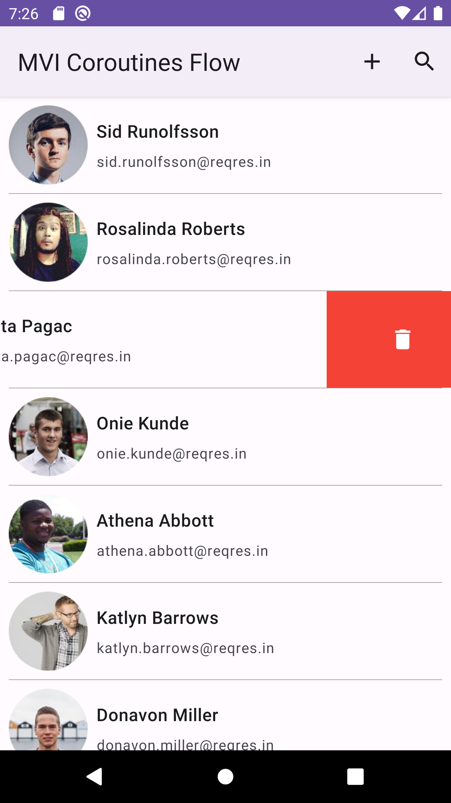
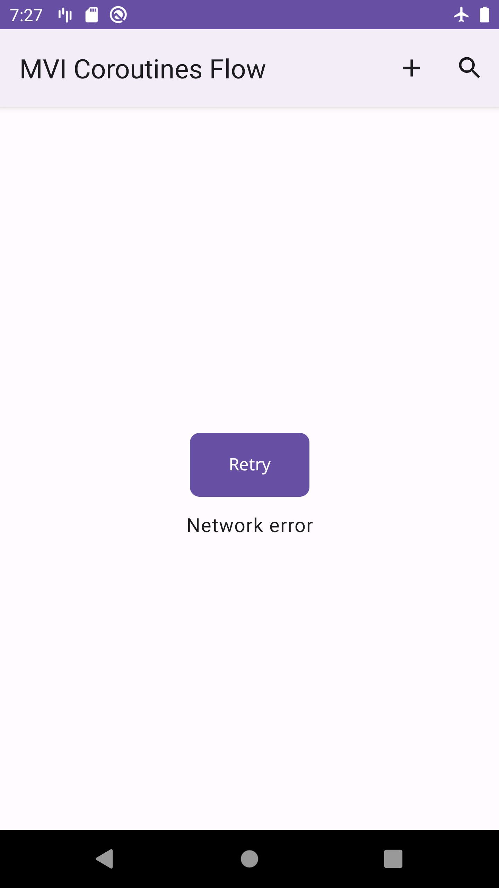
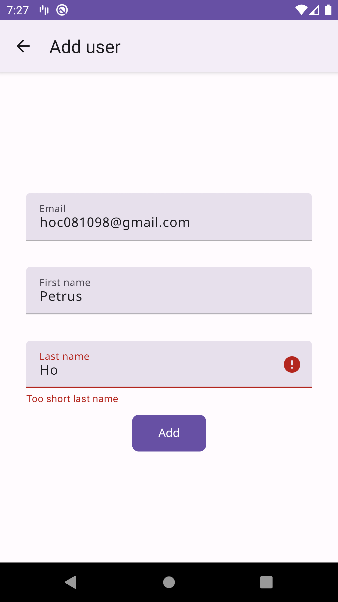
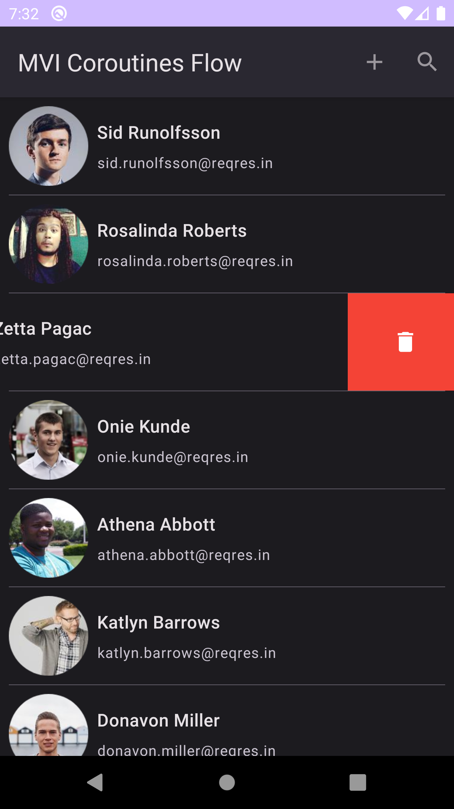
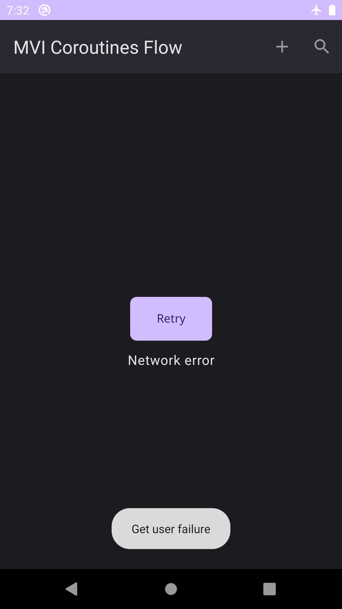
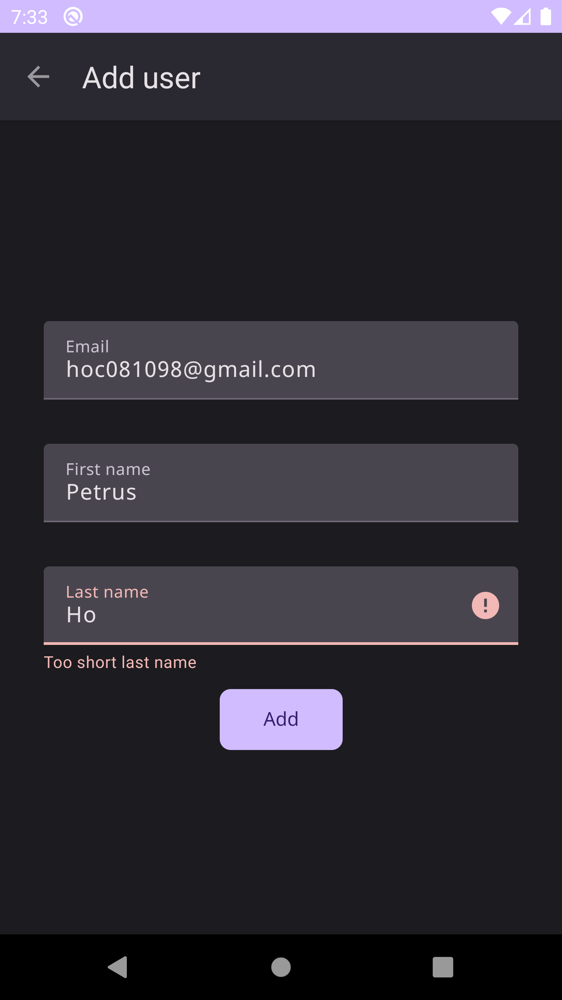
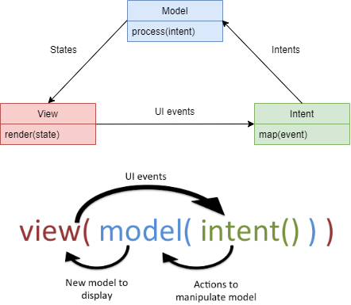

# MVI-Coroutines-Flow
## MVI-Coroutines-Flow-Clean-Architecture
## MVI-Coroutines-Flow-Clean-Architecture-ArrowKt
## MVI-Coroutines-Flow-Clean-Architecture-ArrowKt-KoinDI
<!-- ALL-CONTRIBUTORS-BADGE:START - Do not remove or modify this section -->

<!-- ALL-CONTRIBUTORS-BADGE:END -->

 
Liked some of my work? Buy me a coffee (or more likely a beer)

## Coroutine + Flow = MVI :heart:
*   Play MVI with Kotlin Coroutines Flow.
*   Multiple modules, Clean Architecture, Functional programming with [ΛRROW.kt](https://arrow-kt.io/).
*   Unit tests for MVI ViewModel, domain and data layer.
*   Master branch using Koin for DI.
*   **Checkout [dagger_hilt branch](https://github.com/Kotlin-Android-Open-Source/MVI-Coroutines-Flow/tree/dagger_hilt), using Dagger Hilt for DI** (_obsolete, will update as soon as possible_).
*   **[Download latest debug APK here](https://nightly.link/Kotlin-Android-Open-Source/MVI-Coroutines-Flow/workflows/build/master/app-debug.zip)**.

## More

### 1. Jetpack Compose Version

👉 https://github.com/Kotlin-Android-Open-Source/Jetpack-Compose-MVI-Coroutines-Flow

### 2. Pagination Horizontal List in Vertical List

👉 https://github.com/Kotlin-Android-Open-Source/Pagination-MVI-Flow

### Light theme

| List view state | Error view state |
| --------------- | ---------------- |
|  |  |

| Add new user | Search user  |
| ------------ | ------------ |
|  |  |

### Dark theme

| List view state | Error view state |
| --------------- | ---------------- |
|  |  |

| Add new user | Search user  |
| ------------ | ------------ |
|  |  |

<!-- Pixel 3 XL API 30 -->

## MVI pattern

This pattern was specified by [André Medeiros (Staltz)](https://twitter.com/andrestaltz) for a JavaScript framework he has written called [cycle.js](https://cycle.js.org/). From a theoretical (and mathematical) point of view we could describe Model-View-Intent as follows [^1]

  

- `intent()`: This function takes the input from the user (i.e. UI events, like click events) and translate it to “something” that will be passed as parameter to `model()` function.
  This could be a simple string to set a value of the model to or more complex data structure like an Object. We could say we have the intention to change the model with an intent.
- `model()`: The `model()` function takes the output from `intent()` as input to manipulate the Model. The output of this function is a new Model (state changed).
  So it should not update an already existing Model. **We want immutability!**
  We don’t change an already existing Model object instance.
  We create a new Model according to the changes described by the intent.
  Please note, that the `model()` function is the only piece of your code that is allowed to create a new Model object.
  Then this new immutable Model is the output of this function.
  Basically, the `model()` function calls our apps business logic (could be an Interactor, Usecase, Repository … whatever pattern / terminology you use in your app) and delivers a new Model object as result.
- `view()`: This method takes the model returned from `model()` function and gives it as input to the `view()` function. Then the View simply displays this Model somehow. `view()` is basically the same as `view.render(model)`.

### Reference

- [Model-View-Intent Design Pattern on Android](https://xizzhu.me/post/2021-06-21-android-mvi-kotlin-coroutines-flow-compose/)
- [Reactive Apps with Model-View-Intent](https://hannesdorfmann.com/android/mosby3-mvi-1/)

## Contributors ✨

Thanks goes to these wonderful people ([emoji key](https://allcontributors.org/docs/en/emoji-key)):

<!-- ALL-CONTRIBUTORS-LIST:START - Do not remove or modify this section -->
<!-- prettier-ignore-start -->
<!-- markdownlint-disable -->
<table>
  <tr>
    <td align="center"><a href="https://www.linkedin.com/in/hoc081098/"> <b>Petrus Nguyễn Thái Học</b></a> <a href="https://github.com/Kotlin-Android-Open-Source/MVI-Coroutines-Flow/commits?author=hoc081098" title="Code">💻</a> <a href="#maintenance-hoc081098" title="Maintenance">🚧</a> <a href="#ideas-hoc081098" title="Ideas, Planning, & Feedback">🤔</a> <a href="#design-hoc081098" title="Design">🎨</a> <a href="https://github.com/Kotlin-Android-Open-Source/MVI-Coroutines-Flow/issues?q=author%3Ahoc081098" title="Bug reports">🐛</a></td>
  </tr>
</table>

<!-- markdownlint-restore -->
<!-- prettier-ignore-end -->

<!-- ALL-CONTRIBUTORS-LIST:END -->

This project follows the [all-contributors](https://github.com/all-contributors/all-contributors) specification. Contributions of any kind welcome!

[^1]: https://hannesdorfmann.com/android/mosby3-mvi-2/
